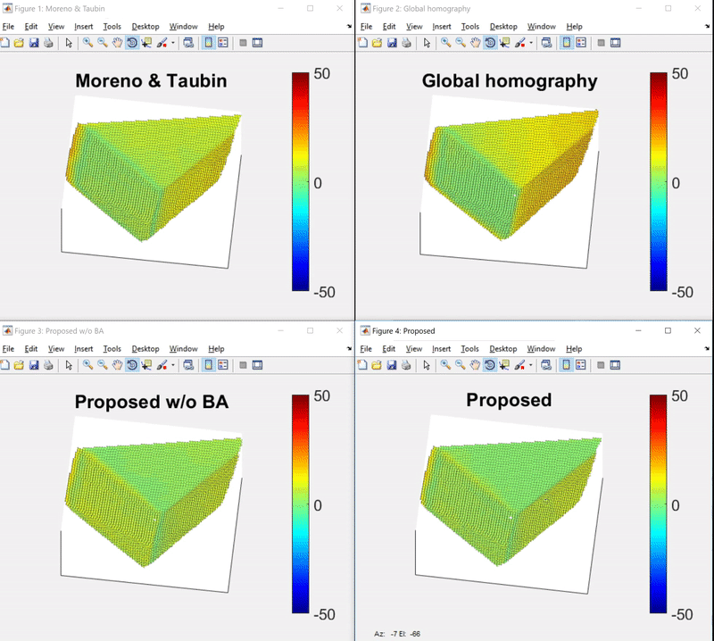

A Single-shot-per-pose Camera-Projector Calibration System For Imperfect Planar Targets
===

## Introduction
A Single-shot-per-pose camera-projector calibration method that deals with imperfect planarity of the calibration target. 

Highlights:
* The proposed method performs camera-projector pair calibration with only a Single-shot-per-pose, making it practically convenient in many applications. It can provide flexible and accurate results even when the board is handheld.
* A bundle adjustment (BA) algorithm is developed to jointly optimize the estimated camera/projector models and feature points in model space. 
* Unlike many existing methods, to calibrate the system, we apply points from a **Structured Light (SL) pattern** rather than from a checkerboard. This strategy boosts not only the number of feature points but also their spatial distribution, and hence improves calibration robustness.

For more info please refer to our [paper][1].

## Required Software & Packages
* MATLAB 2017b
* [mexOpenCV v3.3.0][2]

## Usage
### Reproduce paper results:
1. Run `calibrate.m` to generate experiment results of the proposed method.
2. Run `compareCalibrations.m` to generate comparison results with **real data**.  The proposed method, a generalized global homography-based method, the proposed w/o bundle adjustment and [Moreno & Taubin method][3] are compared.
3. Run `simulateCalib.m` to generate comparison results with **synthetic data** .

----
### Calibrate your own camera-projector pair:


To apply the proposed method to your data, please follow these steps:
1. Print a checkerboard pattern and glue it to a white board. Make sure the checkerboard pattern is at the center of the white board and its width/height is around **1/3** of the white board's width/height.
2. Place the white board (with checkerboard glued to it) in both camera and projector's FOV.
3. Create a folder under directory [data](data) to save the images in the following steps. E.g., refer to [calibration-11-13-17](data/calibration-11-13-17).
4. Generate a structured light pattern and save the pattern image if you have never generated one by:
    ```matlab
    im = ImgProc.genStructuredLight(prjW, prjH);
    imwrite(im,'pattern.png');
    ```
    where `prjW` and `prjH` is your projector's resolution width and height in pixel. 
5. Capture an image of the white board with the camera and save it as `lightGrid[i].png`, where `i` is the ith position, e.g.,  `lightGrid01.png` is the first position.
6. Display the pattern image in full screen mode on your projector and capture an image. and save it as `colorGrid[i].png`, where `i` is the ith position, e.g.,  `colorGrid01.png` is the first position. Make sure the white board is not moved between steps 5 and 6. **Note: please place the white board so that the superimposed color grid cell is at least 5 pixels wide in camera's view.**
7. Change the position and orientation of the white board and repeat steps 5 to 7 **at least three times**.
8. Once sufficient positions are captured, create a file named `calib-info.yml` and type your camera-projector pair configurations, an example file is given as follows:
    ```yaml
    %YAML:1.0
    # Camera image width and height
    camW: 640
    camH: 480

    # Projector image width and height
    prjW: 800
    prjH: 600

    # Number of squares on checkerboard [x y] format
    # Note: Number of inner corners is (x-1)*(y-1)
    boardSize: [12, 15]
        
    # Size of checkerboard squares in mm
    sqSize: 17.1979

    # Sets (position indices) to use for calibration
    sets: [1,2,3,4,5,6,7]
    ```
9. Edit `dataRoot` and `dataName` in  `calibrate.m` to point to the root of data folder and the folder you just created, then run `calibrate.m` to calibrate the camera-projector pair.

## Example Results
* Reprojection error:

    | Method              | Camera  | Projector | Stereo  |
    |---------------------|---------|-----------|---------|
    |[Moreno & Taubin][3] | 0.12356 | 1.5949    | 1.1311  |
    | Global homography   | 0.12356 | 5.7868    | 4.0928  |
    | Proposed w/o BA     | 0.41692 | 0.71052   | 0.58252 |
    | Proposed            | 0.34976 | 0.63517   | 0.51272 |

* 3D alignment error:
    
    After we calibrate the camera-projector pair, we reconstruct a point cloud using [2D structured light point pairs](data/calibration-11-13-17/MT/Set10.yml) and [calibration data](data/calibration-11-13-17/results). To calculate reconstruction accuracy, we also capture the [ground truth point cloud](data/calibration-11-13-17/recon-10.ply) using an Intel RealSense F200 RGBD camera. The point cloud 3D alignment error (Euclidean distance) between the reconstructed point cloud and the ground truth point cloud are given by:

    | Method              | Min      | Max    | Mean   | Median | Std.   |
    |---------------------|----------|--------|--------|--------|--------|
    |[Moreno & Taubin][3] | 0.088551 | 55.194 | 8.4722 | 7.0756 | 5.9264 |
    | Global homography   | 0.016244 | 73.173 | 11.877 | 11.94  | 9.9919 |
    | Proposed w/o BA     | 0.046634 | 48.834 | 6.7798 | 6.8835 | 4.1002 |
    | Proposed            | 0.057853 | 50.807 | 5.5959 | 4.5881 | 4.7023 |

    The per-point 3D alignment error can be viewed in pseudocolor:

    

 
## Folder Structure
The project folder is organized as follows:

    ├─+Calibration                  calibration package directory
    ├─+ImgProc                      image processing package directory
    ├─+Reconstruct                  3d reconstruction package directory
    ├─data                          directory for data
    │  ├─calibration-11-13-17       directory for real data, contains checkerboard/structured light images and RealSense reconstructed ply files.
    │  │  ├─matlabCorners           extracted checkerboard corners by MATLAB's detectCheckerboardPoints and warped corners by the global homography
    │  │  ├─MT                      warped checkerboard points and reconstruction point pairs by Moreno & Taubin's software
    │  │  └─results                 calibration results generated by the four methods mention in the paper with real data
    │  └─simulation                 directory for simulation (synthetic) data
    │      └─results                calibration results generated by the four methods mention in the paper with synthetic data
    ├─doc                           directory for documentation
    └─README.md                     this file
    
## Citation
Please cite these papers in your publications if it helps your research:

    @inproceedings{huang2018a,
        author = "Huang, Bingyao and Ozdemir, Samed and Wei, Ying and Liao, Chunyuan and Ling, Haibin",
        title = "A Single-shot-per-pose Camera-Projector Calibration System For Imperfect Planar Targets",
        year = "2018",
        booktitle = "Adjunct Proceedings of the IEEE International Symposium for Mixed and Augmented Reality 2018 (To appear)"
    }


## License
This software is freely available for non-profit non-commercial use, and may be redistributed under the conditions in [license](LICENSE).


[1]: https://arxiv.org/pdf/1803.09058.pdf
[2]: https://github.com/kyamagu/mexopencv
[3]: http://mesh.brown.edu/calibration/
[4]: https://www.mathworks.com/help/vision/ref/detectcheckerboardpoints.html


