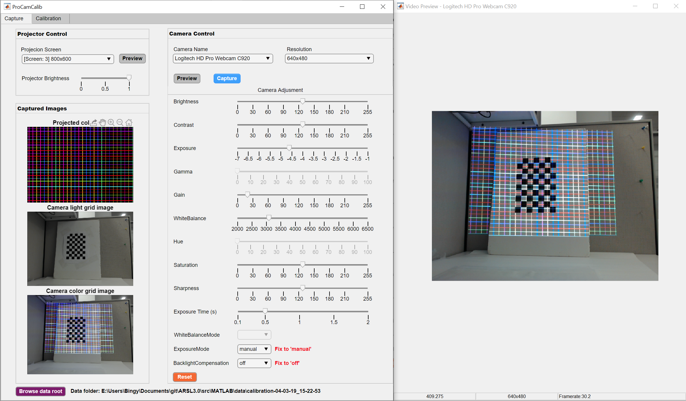
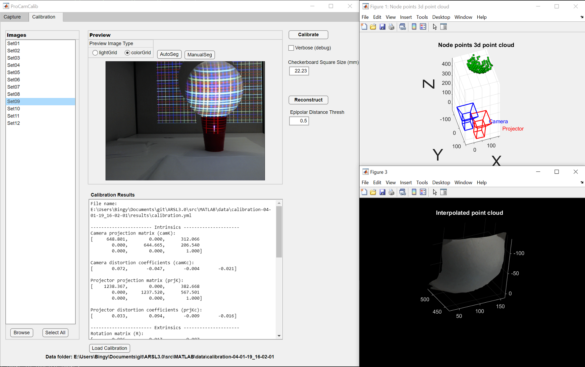

A Fast and Flexible Projector-Camera Calibration System
===

## Introduction
A fast and flexible projector-camera calibration system that is single-shot-per-pose and deals with imperfect planarity of the calibration target. 

Highlights:
* The system explicitly deals with the noise due to imperfect planarity with a novel **bundle adjustment** solution. 
* Our calibration system applies **structured light (SL) pattern keypoints** rather than checkerboard corners. This strategy boosts both the number of keypoints and their spatial distribution, and hence improves calibration robustness.
* Our system requires **only a single shot per pose**, making it practically convenient in many applications.
* A practical **open source projector-camera calibration software** with GUI is provided to benefit the society.

For more info please refer to our [journal paper][8] and [conference paper][1].
* To reproduce [journal paper][8] results please refer to [tase20][9] branch.
* To reproduce [conference paper][1] results please refer to [ismar18][5] branch.

## Updates:
* **06/03/2020: [Journal paper][8] accepted**. 
* **04/02/2020: Windows 64-bit executable released, no need to install MATLAB or OpenCV**. See [Windows 64-bit executable](#windows-64-bit-executable-matlab-and-opencv-not-required) below.

## Usage

#### Build from source
1. Install MATLAB >= 2018b.
2. Install [mexOpenCV v3.3.0][2]
3. Clone this repo and run `calibApp.mlapp` to start the App.

#### Windows 64-bit executable (MATLAB and OpenCV not required)
1. Install [MATLAB Runtime >= 2018b for Windows 64-bit](https://www.mathworks.com/products/compiler/matlab-runtime.html).
2. Download and extract [ProCamCalib_v0.1.zip](https://github.com/BingyaoHuang/single-shot-pro-cam-calib/releases/download/v0.1/ProCamCalib_v0.1.zip).
3. Run `ProCamCalib.exe`.

## Tutorial
1. Watch a short video tutorial [here][6].
2. Note our method works best for camera resolution <=640x480 and projector resolution <=1920x1080. You can resize the camera image to wdith=640 for the best quality and speed. **If you want to use other resolutions please refer to this [issue](https://github.com/BingyaoHuang/single-shot-pro-cam-calib/issues/10).**

----
## Calibration

1. Print a checkerboard pattern and glue it to a white board. Make sure the checkerboard pattern is at the center of the white board and its width/height is around **1/3** of the white board's width/height.
2. Place the white board (with checkerboard glued to it) in front of camera and projector.
3. Run `calibApp.mlapp` (or `ProCamCalib.exe`) to start the App.
4. In the App (see screenshot above), select the projector screen in the top-left `Projector Control` panel dropdown, then click `Preview` on the right of the dropdown to preview the projected structured light pattern.
5. Then select the camera in the top-right `Camera Control` panel, click `Preview` button to start camera review, make sure the white board is in both the camera's and the projector's FOV, i.e, the color grid covers the entire white board and the camera has a full view of the white board.
6. Adjust the projector color grid brightness using the `Projector Brightness` slider and camera parameters using the sliders in `Camera Control` panel. Make sure the color grid is not underexposed or overexposed.
7. Start to capture the images as shown in the gif below. The checkerboard and color grid images will be saved as `lightGrid[i].png` and `colorGrid[i].png`, where `i` is the ith position, e.g.,  `colorGrid01.png` is the color grid image at the 1st position. Although **at least three poses** are sufficient we highly recommend taking more, refer to [Bouguet][7] for a good example.
8. Once sufficient images are captured, click `Calibration` tab on top and select the sets you want to use for calibration, then type the printed checkerboard square size in the text box below `Calibrate` button. Finally click `Calibrate` button.

## 3D reconstruction
1. Note that we use a sparse color grid, thus the reconstructed point cloud is sparse. To obtain a dense point cloud we reconstruct both the grid nodes and edges, then interpolate it to a dense point cloud.
2. Click `Calibration` tab and load a calibration yml file by clicking `Load Calibration`, then select a set in the `Images` list and click `Reconstruct`.
3. You can choose to use `Existing Mask` (saved under data folder) or draw your own object mask.
4. `Use Edges` toggles color grid edge reconstruction.

## Calibration comparisons
_Below are results from our [conference paper][1] and can be reproduced in [ismar18][5] branch._
_For the latest results, please refer to our [journal paper][8] and the results can be reproduced in [tase20][9] branch._

* Reprojection error:

    | Method              | Camera  | Projector | Stereo  |
    |---------------------|---------|-----------|---------|
    |[Moreno & Taubin][3] | 0.12356 | 1.5949    | 1.1311  |
    | Global homography   | 0.12356 | 5.7868    | 4.0928  |
    | Proposed w/o BA     | 0.41692 | 0.7105    | 0.5825  |
    | Proposed            | 0.34976 | 0.6352    | 0.5127  |

* 3D alignment error:
    
    After we calibrate the camera-projector pair, we reconstruct a point cloud using [2D structured light point pairs](https://github.com/BingyaoHuang/single-shot-pro-cam-calib/tree/ismar18/data/calibration-11-13-17/MT/Set10.yml) and [calibration data](https://github.com/BingyaoHuang/single-shot-pro-cam-calib/tree/ismar18/data/calibration-11-13-17/results). To calculate reconstruction accuracy, we also capture the [ground truth point cloud](https://github.com/BingyaoHuang/single-shot-pro-cam-calib/tree/ismar18/data/calibration-11-13-17/recon-10.ply) using an Intel RealSense F200 RGBD camera. The point cloud 3D alignment error (Euclidean distance) between the reconstructed point cloud and the ground truth point cloud are given by:

    | Method              | Min      | Max    | Mean   | Median | Std.   |
    |---------------------|----------|--------|--------|--------|--------|
    |[Moreno & Taubin][3] | 0.088551 | 55.194 | 8.4722 | 7.0756 | 5.9264 |
    | Global homography   | 0.016244 | 73.173 | 11.877 | 11.94  | 9.9919 |
    | Proposed w/o BA     | 0.046634 | 48.834 | 6.7798 | 6.8835 | 4.1002 |
    | Proposed            | 0.057853 | 50.807 | 5.5959 | 4.5881 | 4.7023 |

    The per-point 3D alignment error can be viewed in pseudocolor:

    

 
## Folder Structure
The project folder is organized as follows:

    ├─+Calibration                                  calibration package directory
    ├─+ImgProc                                      image processing package directory
    ├─+Reconstruct                                  3d reconstruction package directory
    ├─data                                          directory for data
    │  ├─calibration-04-01-19_16-02-01              directory for real data, contains checkerboard/structured light images and RealSense reconstructed ply files.
    │  │  ├─matlabCorners                           extracted checkerboard corners by MATLAB's detectCheckerboardPoints and warped corners by the global homography             
    │  │  └─results                                 calibration results generated by the four methods mention in the paper with real data
    │  └─simulation                                 directory for simulation (synthetic) data
    │      └─results                                calibration results generated by the four methods mention in the paper with synthetic data
    ├─doc                                           directory for documentation
    └─README.md                                     this file
    
## Citation
Please cite these papers in your publications if it helps your research:

    @article{huang2020flexible,
        title={A Fast and Flexible Projector-Camera Calibration System}, 
        author={Huang, Bingyao and Tang, Ying and Ozdemir, Samed and Ling, Haibin},
        journal={IEEE Transactions on Automation Science and Engineering}, 
        year={2020},
        doi = {10.1109/TASE.2020.2994223}
    }

    @inproceedings{huang2018single,
        title={A Single-shot-per-pose Camera-Projector Calibration System For Imperfect Planar Targets},
        author={Huang, Bingyao and Ozdemir, Samed and Tang, Ying and Liao, Chunyuan and Ling, Haibin},
        booktitle={2018 IEEE International Symposium on Mixed and Augmented Reality Adjunct (ISMAR-Adjunct)},
        pages={15--20},
        year={2018},
        organization={IEEE}
    }

    @inproceedings{huang2014fast,
        title={Fast 3D reconstruction using one-shot spatial structured light},
        author={Huang, Bingyao and Tang, Ying},
        booktitle={2014 IEEE International Conference on Systems, Man, and Cybernetics (SMC)},
        pages={531--536},
        year={2014},
        organization={IEEE}
    }

## License
This software is freely available for non-profit non-commercial use, and may be redistributed under the conditions in [license](LICENSE).

[1]: https://arxiv.org/pdf/1803.09058.pdf
[2]: https://github.com/kyamagu/mexopencv
[3]: http://mesh.brown.edu/calibration/
[4]: https://www.mathworks.com/help/vision/ref/detectcheckerboardpoints.html
[5]: https://github.com/BingyaoHuang/single-shot-pro-cam-calib/tree/ismar18
[6]: https://youtu.be/fnrVDOhcu7I
[7]: http://www.vision.caltech.edu/bouguetj/calib_doc/htmls/calib_example/index.html
[8]: http://vision.cs.stonybrook.edu/~bingyao/pub/calibration_TASE
[9]: https://github.com/BingyaoHuang/single-shot-pro-cam-calib/tree/tase20